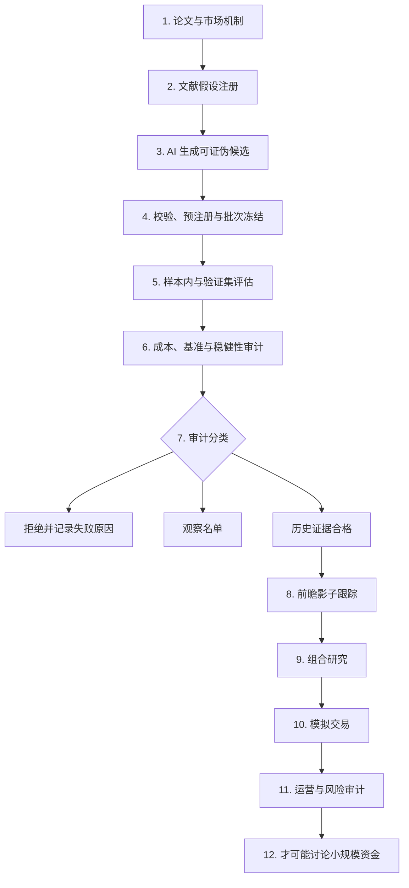

# BTCLab AI Panel Factor Factory

> 一个文献约束、审计优先的加密资产横截面因子研究项目。

**English summary:** BTCLab is a literature-constrained, audit-first research
framework for testing crypto cross-sectional factors. AI proposes falsifiable
candidates; deterministic code freezes, evaluates, records, and rejects them.
The project is research software, not a claim of profitable deployment.

## 一句话说明

我们不是让 AI 不断试公式，直到碰巧得到漂亮回测。我们希望建立一条可审计的研究流水线：

**文献给方向，AI 给候选，程序做裁判，未来数据给最终证据。**

## 为什么做这个项目

量化研究最常见的问题之一是虚假收益，也叫假 alpha（假超额收益）。当研究者反复尝试指标、参数和样本切分时，即使市场完全随机，也可能找到看起来优秀的历史结果。

BTCLab 尝试通过以下制度降低这种风险：

- Literature registry（文献注册表）：候选必须来自预先登记的经济机制和论文来源。
- Preregistration（预注册）：公式在评估前冻结，看到结果后不能沿用同一候选编号修改。
- Trial registry（试验登记）：成功、失败、语法拒绝和人工候选都计入试验次数。
- Holdout isolation（保留集隔离）：Holdout 只用于最终审计，不反馈给 AI 调参。
- Multiple-testing control（多重检验控制）：尝试越多，统计门槛越严格。
- Economic audit（经济审计）：手续费、滑点、资金费、换手率、容量和回撤都必须进入判断。
- Prospective evidence（前瞻证据）：通过历史检查只代表值得继续观察，不能直接进入实盘。

## 研究流程



Holdout（保留集）不会回到 AI 生成环节。没有通过的候选也不会被删除，因为失败本身是研究证据。

## AI 做什么，不做什么

AI 可以：

- 阅读已登记文献并提出可证伪假设；
- 将经济机制翻译成标准化 panel formula（横截面公式）；
- 生成候选元数据、测试和研究报告；
- 根据样本内和验证集失败原因提出新的研究方向。

AI 不可以：

- 查看 Holdout 细节后反向修改候选；
- 绕过文献来源、试验预算或批次冻结；
- 自己宣布候选可以交易；
- 把历史回测通过等同于未来盈利。

## 当前公开基线

截至 2026-07-19，这个公开快照包括：

- 50 个已登记 OKX 永续资产，以及逐时点最多 40 个资产的流动性筛选；
- 730 天历史 panel（面板）数据接口与缓存审计逻辑；
- 价格、成交额、真实稀疏 funding（资金费）、basis（基差）、open interest（持仓量）、市值、上市年龄和资产标签支持；
- 文献注册、候选冻结、trial registry、多重检验、基准和稳健性审计；
- prospective shadow tracking（前瞻影子跟踪）和 promotion（晋级）政策；
- 本地 Python 3.11 环境下 **294 项测试通过**。

这不代表已经获得可部署策略。当前项目仍处于研究和前瞻证据积累阶段，没有任何收益保证，也不应据此投入资金。

## 代码地图

| 文件 | 作用 |
| --- | --- |
| `LITERATURE_HYPOTHESIS_REGISTRY.md` | 文献、经济机制、公式族和失败条件 |
| `panel_ai_candidate_generator.py` | 在注册文献约束内生成候选 |
| `panel_candidate_registry.py` | 候选 schema、批次冻结和登记 |
| `panel_factor_research.py` | Panel 回测、成本和稳健性评估 |
| `panel_gate_policy_v3.py` | 历史审计门槛与状态规则 |
| `panel_run_registry.py` | 可审计运行记录和输入指纹 |
| `prospective_factor_snapshot.py` | 冻结因子的未来影子快照 |
| `strategy_*` | 组合、策略、怀疑者审计与导出层 |
| `tests/` | 数据边界、审计逻辑和完整流程测试 |
| `FACTORY_MASTER_ROADMAP.md` | 当前目标、完成项、阻塞项和长期路线 |

## 快速验证

建议使用 Python 3.11：

```bash
git clone https://github.com/qniequn-boop/btclab-factor-factory-public.git
cd btclab-factor-factory-public
python -m venv .venv
python -m pip install -r requirements.txt
python -m pytest -q
```

仓库不包含行情缓存、运行日志、交易所密钥、云凭证或服务器配置值。部分完整研究流程需要自行获取公开市场数据。

## 推荐阅读顺序

1. `FACTORY_MASTER_ROADMAP.md`：先了解最终目标与当前进度。
2. `LITERATURE_HYPOTHESIS_REGISTRY.md`：了解候选为什么必须有文献和经济机制。
3. `PANEL_DATA_SUBSTRATE_V2.md`：了解时间点一致性、退市偏差和数据限制。
4. `RESEARCH_ALIGNMENT_RED_TEAM_AUDIT_20260717.md`：查看独立怀疑者视角的自审。
5. `PROSPECTIVE_FACTOR_PROMOTION_POLICY_V1.json`：了解为什么历史通过后仍需等待未来数据。

## 已知限制

- 加密市场历史较短，制度和市场状态变化快。
- 当前交易标的来自现存合约，冻结日前的历史研究仍受退市与幸存者偏差限制。
- 日频或低频因子无法代表专业做市与低延迟策略能力。
- Funding、basis 和流动性收益可能被费用、冲击成本和做空约束消耗。
- 多重检验控制只能降低数据挖掘风险，不能证明未来一定有效。
- 前瞻观察、模拟交易和真实执行是不同阶段，不能互相替代。

## 公开版与私人版

这个仓库是面向公开复核的研究快照。完整研发仓库保持私有，并继续保存运行记录、未公开实验和服务器运维内容。公开版只会在经过筛选后主动更新，不会自动同步私人仓库。

## 研究声明

本项目仅用于教育、研究和方法讨论，不构成投资建议。任何历史收益、统计关系或候选状态都不代表未来表现。使用者应独立验证数据、代码、交易成本、法律要求和风险承受能力。
