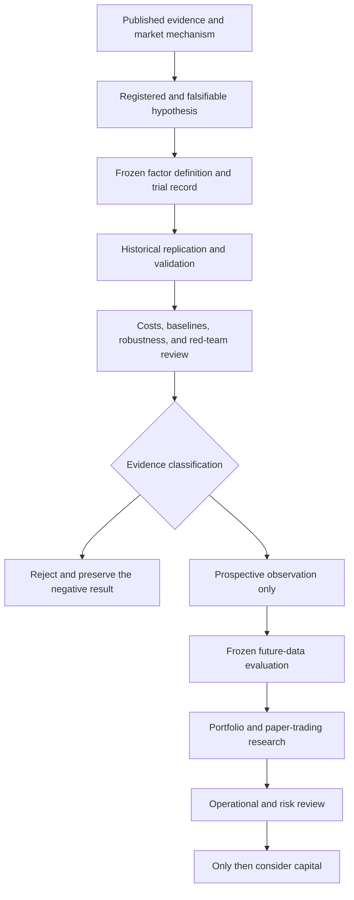

# Open Crypto Factor Research

**Language:** **English** | [简体中文](./README.zh-CN.md)

[](https://github.com/qniequn-boop/open-crypto-factor-research/actions/workflows/ci.yml)
[](./LICENSE)
[](./CITATION.cff)

> A reproducible, literature-grounded framework for empirical research on
> cryptocurrency cross-sectional factors.

Open Crypto Factor Research studies whether reported crypto return relations
survive point-in-time data constraints, multiple testing, realistic costs,
robustness checks, and genuinely future observations. The repository is a
research instrument, not a catalogue of profitable trading signals.

## Current Claim

**No factor, portfolio, or strategy in this repository is approved for live
capital.** One frozen 90-day low-volatility relation has earned prospective
shadow observation after historical analysis. That status means "collect new
evidence without changing the rule," not "validated alpha."

See [EVIDENCE_STATUS.md](./EVIDENCE_STATUS.md) for the complete claim ledger.

## Research Questions

1. Which published cryptocurrency factor relations replicate in a
   cross-sectional panel under a declared adaptation?
2. Which relations remain economically meaningful after turnover, fees,
   slippage, funding, liquidity, and capacity constraints?
3. How much apparent evidence disappears after accounting for repeated trials,
   unstable regimes, and data-universe bias?
4. Can frozen factor definitions accumulate prospective evidence without
   feeding future outcomes back into candidate selection?

The project prioritizes economic mechanisms and net implementability. Test
counts and automation are controls that protect the evidence, not research
success by themselves.

## Evidence Pipeline



Historical acceptance cannot directly authorize a combination or a trade.
Holdout details are isolated from candidate revision, and rejected trials stay
in the record because negative results are part of the evidence.

## Current Evidence Snapshot

| Research component | Public evidence status |
| --- | --- |
| Data substrate | 50 registered OKX assets, point-in-time top-40 eligibility, and audited 730-day interfaces; pre-freeze history remains survivor-conditioned |
| Canonical momentum replications | Six frozen historical paths rejected |
| Perpetual basis and funding | Twelve frozen two-leg paths rejected after costs; family closed on the current sample |
| Monthly low volatility | 60-day path rejected; 90-day path allowed only into unchanged prospective observation |
| Historical order-book evidence | Official OKX L2 reconstruction is feasible; one day and three assets cannot calibrate a production cost surface |
| Factor promotion | None |
| Portfolio, paper trading, or deployment | None |

This table deliberately separates engineering readiness from economic
evidence. A working evaluator does not imply that the evaluated relation is
real, and a historical clue does not imply future profitability.

## Methodological Safeguards

- **Literature grounding:** an eligible candidate cites a registered source and
  states its economic mechanism, required fields, expected sign, baselines, and
  failure conditions.
- **Preregistration:** the factor definition and evaluation batch are frozen
  before outcomes are observed.
- **Complete trial accounting:** generated, manual, failed, and syntax-rejected
  candidates all contribute to the trial budget.
- **Multiplicity control:** statistical burden increases with the number and
  dependence of attempted hypotheses.
- **Holdout isolation:** Holdout details cannot enter model prompts or revision
  feedback.
- **Economic auditing:** turnover, fees, slippage, funding, drawdown, liquidity,
  and execution assumptions are explicit.
- **Prospective evaluation:** historical clues may earn only the right to be
  observed unchanged on future data.
- **Red-team review:** independent reconstruction and skeptical audits look for
  leakage, sign changes, unsupported adaptations, and false promotion.

These controls reduce avoidable self-deception. They do not prove that a factor
will persist.

## Role of AI

AI-assisted hypothesis generation is one optional research method in this
repository. It can translate registered mechanisms into standardized,
falsifiable candidates and help organize failure analysis. It cannot choose its
own evidence standard, see sealed Holdout details, bypass trial budgets, or
declare a signal tradeable. Deterministic code and frozen policies make the
classification.

## Reproducible Baseline

The current public baseline is Python 3.11 with **294 collected and passing
tests**. The machine-readable source of truth is
[`CURRENT_BASELINE.json`](./CURRENT_BASELINE.json), checked independently by
GitHub Actions on every commit to `main`.

Historical counts such as 274, 278, and 288 remain in dated reports as
development records. They are not alternative current baselines.

```bash
git clone https://github.com/qniequn-boop/open-crypto-factor-research.git
cd open-crypto-factor-research
python -m venv .venv
python -m pip install --require-hashes -r requirements.txt
python -m pytest -q
```

The repository excludes exchange keys, cloud credentials, server settings,
ordinary runtime logs, and market-data caches. Full empirical reruns require
researchers to obtain the relevant public market data independently. See
[REPRODUCIBILITY.md](./REPRODUCIBILITY.md) for exact boundaries and procedures.

## Repository Guide

| Start here | Purpose |
| --- | --- |
| [RESEARCH_SCOPE.md](./RESEARCH_SCOPE.md) | Research questions, scope, claim boundaries, and the role of AI |
| [EVIDENCE_STATUS.md](./EVIDENCE_STATUS.md) | Current positive, negative, incomplete, and prospective evidence |
| [REPRODUCIBILITY.md](./REPRODUCIBILITY.md) | Environment, locked dependencies, CI, data boundaries, and verification |
| [CONTRIBUTING.md](./CONTRIBUTING.md) | Standards for hypotheses, replications, code, and evidence language |
| [LITERATURE_HYPOTHESIS_REGISTRY.md](./LITERATURE_HYPOTHESIS_REGISTRY.md) | Registered literature mechanisms and falsification requirements |
| [PANEL_DATA_SUBSTRATE_V2.md](./PANEL_DATA_SUBSTRATE_V2.md) | Universe construction, missingness, and survivorship boundaries |
| [RESEARCH_ALIGNMENT_RED_TEAM_AUDIT_20260717.md](./RESEARCH_ALIGNMENT_RED_TEAM_AUDIT_20260717.md) | Independent alignment and skeptic audit |
| [FACTORY_MASTER_ROADMAP.md](./FACTORY_MASTER_ROADMAP.md) | Detailed development history and long-horizon research gates |

Some internal modules and historical records retain the earlier `BTCLab` and
`factor factory` names. They are preserved to keep paths, hashes, and dated
research artifacts reproducible; they do not define the public research claim.

## Known Limits

- Crypto histories are short and market institutions change rapidly.
- The current registered pool begins with surviving contracts, so pre-freeze
  analysis cannot support claims about the delisted or illiquid majority.
- A 50-asset registry and top-40 panel remain small relative to equity factor
  studies.
- Daily and monthly research does not reproduce low-latency execution or
  market-making capabilities.
- Funding, basis, and liquidity premia may be consumed by financing, impact,
  borrow constraints, and operational failures.
- Multiple-testing controls and prospective tracking reduce specific risks;
  neither guarantees external validity or future profit.

## Contributing and Citation

Replication attempts, negative results, data audits, and mechanism-based
hypotheses are welcome when they preserve the preregistration and evidence
boundaries in [CONTRIBUTING.md](./CONTRIBUTING.md).

GitHub exposes citation metadata from [CITATION.cff](./CITATION.cff). The code
is available under the [MIT License](./LICENSE).

## Research Disclaimer

This project is for research, education, and methodological discussion. It is
not investment advice. Historical returns, statistical relationships, and
internal classifications do not imply future performance. Users must verify
data, code, costs, legal requirements, and risk independently.
