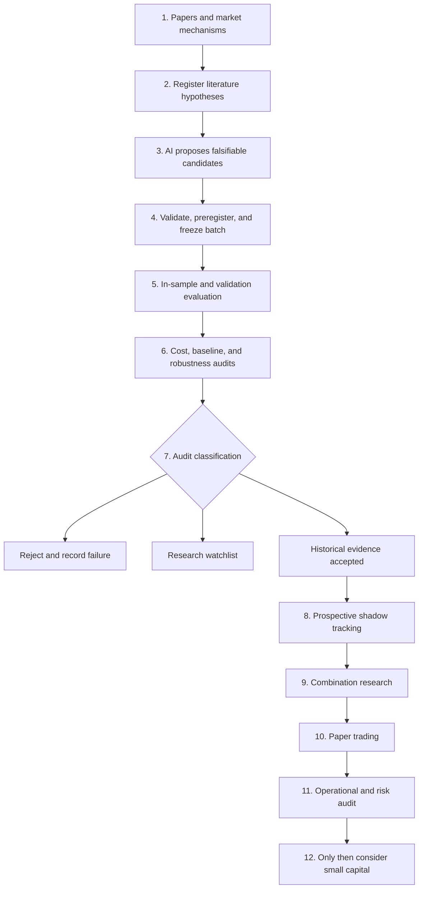

# BTCLab AI Panel Factor Factory

**Language:** **English** | [简体中文](./README.zh-CN.md)

> A literature-constrained, audit-first research project for crypto
> cross-sectional factors.

## In One Sentence

We are not asking AI to try formulas until one happens to produce an attractive
backtest. We are building an auditable research pipeline:

**Literature sets the direction, AI proposes candidates, deterministic code
judges them, and future data provides the final evidence.**

## Why This Project Exists

False alpha is one of the most common problems in quantitative research. When
researchers repeatedly try indicators, parameters, and sample splits, even a
random market can produce impressive historical results by chance.

BTCLab attempts to reduce that risk through the following controls:

- **Literature registry:** every eligible candidate must cite a preregistered
  economic mechanism and research source.
- **Preregistration:** formulas are frozen before evaluation and cannot be
  revised under the same candidate ID after results are observed.
- **Trial registry:** successful, failed, manually created, and syntax-rejected
  candidates all count as trials.
- **Holdout isolation:** Holdout data is used only for final audit and is never
  returned to AI for tuning.
- **Multiple-testing control:** the statistical burden increases as more
  hypotheses are tried.
- **Economic audit:** fees, slippage, funding, turnover, capacity, and drawdown
  are part of the decision.
- **Prospective evidence:** passing historical checks permits continued
  observation, not immediate deployment.

## Research Workflow



Holdout evidence never flows back into AI generation. Rejected candidates are
not erased because failure is itself research evidence.

## What AI Does and Does Not Do

AI may:

- read registered literature and propose falsifiable hypotheses;
- translate economic mechanisms into standardized panel formulas;
- generate candidate metadata, tests, and research reports;
- use in-sample and validation failures to suggest new research directions.

AI may not:

- inspect Holdout details and reverse-engineer a revised candidate;
- bypass source registration, trial budgets, or batch freezing;
- declare a candidate ready for trading;
- treat a successful historical backtest as proof of future profit.

## Current Public Baseline

As of 2026-07-19, this public snapshot includes:

- 50 registered OKX perpetual assets and a point-in-time liquidity universe of
  at most 40 assets;
- interfaces and cache audits for a 730-day historical panel;
- support for price, quote volume, sparse realized funding, basis, open
  interest, market capitalization, listing age, and asset labels;
- literature registration, candidate freezing, trial accounting,
  multiple-testing controls, baselines, and robustness audits;
- prospective shadow tracking and promotion policies;
- **294 passing tests** under the local Python 3.11 environment.

This does not mean the project has produced a deployable strategy. It remains
in the research and prospective-evidence stage. There is no return guarantee,
and the repository should not be used as a reason to deploy capital.

## Code Map

| File | Purpose |
| --- | --- |
| `LITERATURE_HYPOTHESIS_REGISTRY.md` | Literature, mechanisms, formula families, and failure conditions |
| `panel_ai_candidate_generator.py` | Candidate generation within registered-source constraints |
| `panel_candidate_registry.py` | Candidate schema, frozen batches, and trial admission |
| `panel_factor_research.py` | Panel evaluation, costs, baselines, and robustness checks |
| `panel_gate_policy_v3.py` | Historical audit thresholds and status rules |
| `panel_run_registry.py` | Auditable runs and input fingerprints |
| `prospective_factor_snapshot.py` | Future shadow snapshots for frozen factors |
| `strategy_*` | Combination, strategy, skeptic audit, and export layers |
| `tests/` | Data boundaries, audit behavior, and end-to-end tests |
| `FACTORY_MASTER_ROADMAP.md` | Goals, completed work, blockers, and long-term roadmap |

## Quick Validation

Python 3.11 is recommended:

```bash
git clone https://github.com/qniequn-boop/btclab-factor-factory-public.git
cd btclab-factor-factory-public
python -m venv .venv
python -m pip install -r requirements.txt
python -m pytest -q
```

The repository does not contain market-data caches, ordinary runtime logs,
exchange keys, cloud credentials, or server configuration values. Some full
research workflows require users to acquire public market data independently.

## Suggested Reading Order

1. `FACTORY_MASTER_ROADMAP.md`: understand the final objective and current
   stage.
2. `LITERATURE_HYPOTHESIS_REGISTRY.md`: see why candidates require literature
   and an economic mechanism.
3. `PANEL_DATA_SUBSTRATE_V2.md`: understand point-in-time eligibility,
   delisting bias, and data limitations.
4. `RESEARCH_ALIGNMENT_RED_TEAM_AUDIT_20260717.md`: read the independent
   skeptic's review.
5. `PROSPECTIVE_FACTOR_PROMOTION_POLICY_V1.json`: see why historical acceptance
   is followed by future observation.

## Known Limitations

- Crypto history is short, and both market regimes and institutions change
  quickly.
- The registered universe begins with currently surviving contracts, so
  pre-freeze history remains exposed to delisting and survivorship bias.
- Daily or low-frequency factors do not reproduce the capabilities of
  professional market-making or low-latency systems.
- Funding, basis, and liquidity premia may be consumed by fees, market impact,
  and shorting constraints.
- Multiple-testing controls reduce data-mining risk but cannot prove future
  effectiveness.
- Prospective observation, paper trading, and real execution are separate
  stages and cannot substitute for one another.

## Public and Private Editions

This repository is a curated public research snapshot. The full development
repository remains private and continues to store operational records,
unpublished experiments, and server-maintenance material. Public releases are
selected deliberately and are not synchronized automatically from the private
repository.

## Research Disclaimer

This project is for education, research, and methodological discussion only.
It is not investment advice. Historical returns, statistical relationships,
and candidate statuses do not imply future performance. Users must
independently verify data, code, trading costs, legal requirements, and their
own risk tolerance.
