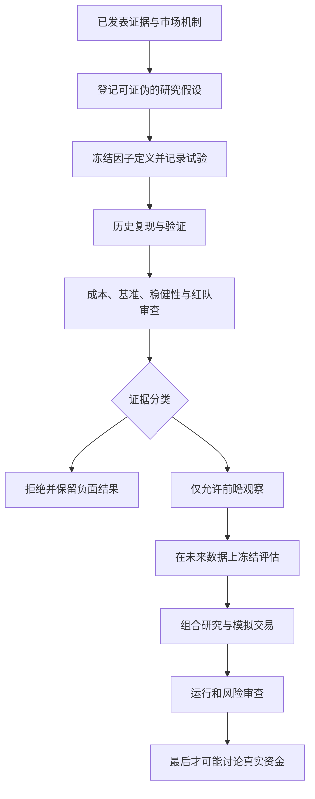

# 开放式加密资产因子研究

**语言：** [English](./README.md) | **简体中文**

[](https://github.com/qniequn-boop/open-crypto-factor-research/actions/workflows/ci.yml)
[](./LICENSE)
[](./CITATION.cff)

> 一个以文献为基础、可复现、可审计的加密资产横截面因子实证研究框架。

Open Crypto Factor Research（开放式加密资产因子研究）关注一个核心问题：
文献中报告的加密资产收益关系，在面对逐时点数据约束、多重检验、真实成本、
稳健性检查和真正的未来数据后，是否依然成立。本仓库是研究工具，不是赚钱信号目录。

## 当前能下什么结论

**本仓库目前没有任何因子、组合或策略获准投入真实资金。** 一个冻结的 90 日
低波动率关系在历史研究后获得了 Prospective shadow observation（前瞻影子观察）
资格。它的含义只是“保持规则不变，继续收集未来证据”，不是“已经验证出 alpha
（超额收益）”。

完整结论账本见 [EVIDENCE_STATUS.md](./EVIDENCE_STATUS.md)。

## 我们研究什么

1. 已发表的加密资产因子关系，能否在事先声明的适配方法下被复现？
2. 加入换手、手续费、滑点、资金费、流动性和容量后，哪些关系仍有经济意义？
3. 在计入重复试验、市场状态变化和样本资产偏差后，有多少漂亮结果会消失？
4. 冻结后的因子能否在不把未来结果反馈给候选生成的情况下，积累真正的前瞻证据？

项目优先关注经济机制和扣除成本后的可实施性。测试数量和自动化用于保护证据，
它们本身不等于研究成功。

## 证据流程



历史结果不能直接授权组合或交易。Holdout（保留集）的细节不会反馈给候选修改；
被拒绝的试验也不会删除，因为负面结果同样是研究证据。

## 当前证据快照

| 研究部分 | 公开证据状态 |
| --- | --- |
| 数据基础 | 50 个已登记 OKX 资产、逐时点最多 40 个流动资产、730 日数据接口已审计；冻结日前历史仍有幸存者偏差 |
| 经典动量复现 | 6 条冻结历史路径全部拒绝 |
| 永续 basis 与 funding | 12 条双腿路径在成本后全部拒绝；当前样本内该家族已关闭 |
| 月度低波动率 | 60 日路径拒绝；90 日路径只获准保持不变地做前瞻观察 |
| 历史订单簿证据 | OKX 官方 L2 数据可以稳定重建；1 天、3 个资产不足以校准生产级成本曲面 |
| Factor promotion（因子正式晋级） | 无 |
| 组合、模拟交易或实盘 | 无 |

这张表刻意把“工程能运行”和“经济证据成立”分开。评估器可以工作，不代表被评估
的关系真实；历史线索存在，也不代表未来能赚钱。

## 一分钟合成研究 Demo

不下载任何行情数据，也可以运行完整的证据边界演示：

```bash
python examples/run_synthetic_evidence_demo.py
```

这个固定结果的合成示例直接调用项目现有的泄漏审计、多重检验调整和历史发现分类器。
它会展示：一个偷看未来的候选被拒绝；一个表面上 `p < 0.05` 的候选因家族多重检验
而失去晋级资格；一个更强的线索也只能得到 `prospective_eligible`（允许前瞻观察）。
最终正式通过因子仍为零，组合、模拟交易和真实资金权限全部关闭。

添加 `--json` 可以得到机器可读结果。这个 Demo 验证的是研究逻辑，不是加密市场
实证结论。

## 研究约束

- **Literature grounding（文献约束）：** 候选必须引用已登记来源，并说明经济机制、
  所需字段、预期方向、基准和失败条件。
- **Preregistration（预注册）：** 在看到结果前冻结因子定义和评估批次。
- **Trial accounting（完整试验计数）：** AI 生成、人工提出、运行失败和语法拒绝的
  候选全部计入预算。
- **Multiple-testing control（多重检验控制）：** 尝试越多、候选相关性越强，统计证据
  需要承担的惩罚越大。
- **Holdout isolation（保留集隔离）：** 保留集细节不能进入 AI 提示或修改反馈。
- **Economic audit（经济审计）：** 换手、手续费、滑点、资金费、回撤、流动性和执行
  假设必须明确报告。
- **Prospective evaluation（前瞻评估）：** 历史线索最多只能获得“按原规则观察未来”
  的资格。
- **Red-team review（红队审查）：** 用独立重建和怀疑者视角检查泄漏、换方向、不当
  适配和错误晋级。

这些制度能降低自我欺骗的概率，但不能证明某个因子一定长期存在。

## AI 在这里做什么

AI-assisted hypothesis generation（AI 辅助假设生成）只是本项目的一种研究方法。
AI 可以把已登记的经济机制翻译成标准、可证伪的候选，也可以帮助整理失败原因；
但它不能自己制定证据标准、查看封存的 Holdout 细节、绕过试验预算，或者宣布一个
信号可以交易。最终分类由确定性程序和冻结政策完成。

## 可复现基线

当前公开基线为 Python 3.11，**收集并通过 296 项测试**。机器可读的唯一基线是
[`CURRENT_BASELINE.json`](./CURRENT_BASELINE.json)，GitHub Actions 会在每次提交到
`main` 后独立验证。

历史报告中的 274、278、288 等数字保留为开发记录，不是多个互相竞争的当前基线。

```bash
git clone https://github.com/qniequn-boop/open-crypto-factor-research.git
cd open-crypto-factor-research
python -m venv .venv
python -m pip install --require-hashes -r requirements.txt
python -m pytest -q
```

仓库不包含交易所密钥、云凭证、服务器配置、普通运行日志和行情缓存。完整实证复现
需要研究者独立获取相应公开行情数据。具体边界见
[REPRODUCIBILITY.md](./REPRODUCIBILITY.md)。

## 阅读入口

| 建议入口 | 作用 |
| --- | --- |
| [RESEARCH_SCOPE.md](./RESEARCH_SCOPE.md) | 研究问题、范围、结论边界和 AI 的角色 |
| [EVIDENCE_STATUS.md](./EVIDENCE_STATUS.md) | 当前正面、负面、不完整和前瞻证据 |
| [REPRODUCIBILITY.md](./REPRODUCIBILITY.md) | 环境、锁定依赖、CI、数据边界和验证方法 |
| [CONTRIBUTING.md](./CONTRIBUTING.md) | 提交假设、复现、代码和研究结论的规范 |
| [examples/run_synthetic_evidence_demo.py](./examples/run_synthetic_evidence_demo.py) | 无需行情数据的泄漏、多重检验和晋级边界演示 |
| [LITERATURE_HYPOTHESIS_REGISTRY.md](./LITERATURE_HYPOTHESIS_REGISTRY.md) | 已登记文献机制和证伪要求 |
| [PANEL_DATA_SUBSTRATE_V2.md](./PANEL_DATA_SUBSTRATE_V2.md) | 资产池、缺失值和幸存者偏差边界 |
| [RESEARCH_ALIGNMENT_RED_TEAM_AUDIT_20260717.md](./RESEARCH_ALIGNMENT_RED_TEAM_AUDIT_20260717.md) | 独立对齐和怀疑者审计 |
| [FACTORY_MASTER_ROADMAP.md](./FACTORY_MASTER_ROADMAP.md) | 详细开发历史和长期研究门槛 |

部分内部模块和历史记录仍保留早期的 `BTCLab` 与 `factor factory` 名称。为了保证
路径、哈希和带日期研究材料可复现，这些名称不会被事后改写；它们不代表公开项目
现在的研究结论。

## 已知限制

- 加密市场历史较短，制度和市场状态变化很快。
- 当前登记池从现存合约开始，因此冻结日前分析不能代表已退市或低流动性资产整体。
- 50 个登记资产、最多 40 个资产的横截面，仍显著小于传统股票因子研究。
- 日频和月频研究不能复制低延迟交易或专业做市能力。
- Funding（资金费）、basis（基差）和流动性收益可能被融资、冲击成本、借币限制与
  运行故障消耗。
- 多重检验和前瞻跟踪只能降低特定风险，不能保证外部有效性或未来盈利。

## 贡献与引用

我们欢迎复现尝试、负面结果、数据审计和基于机制的假设，前提是遵守
[CONTRIBUTING.md](./CONTRIBUTING.md) 中的预注册与证据边界。

GitHub 会读取 [CITATION.cff](./CITATION.cff) 提供引用信息。代码依据
[MIT License](./LICENSE) 开放。

## 研究声明

本项目只用于研究、教育和方法讨论，不构成投资建议。历史收益、统计关系和内部状态
都不代表未来表现。使用者必须独立核验数据、代码、成本、法律要求和风险。
